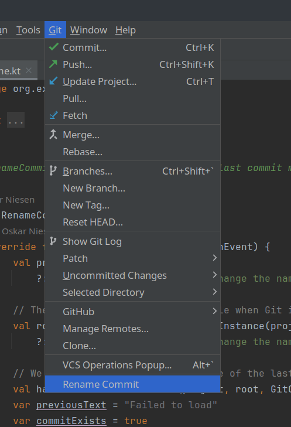
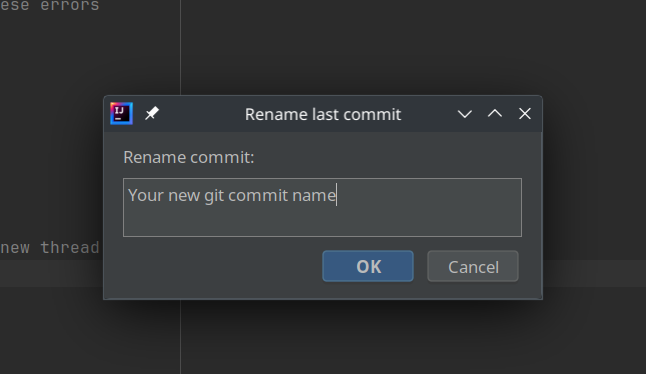
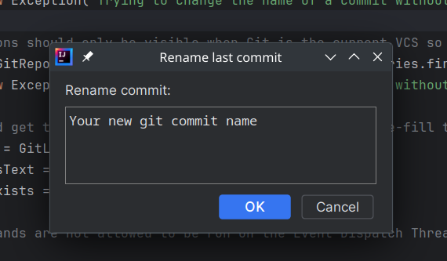

## Rename your Git commits easier

This Intellij plugin helps you rename your git commits by adding a convenient toolbar item under Git.
Clicking it opens up a dialog to provide the new name of the commit.

The major source files can be found at:
* [Kotlin](https://github.com/tuvus/IntellijGitRenameCommitPlugin/blob/main/src/main/kotlin/org/example/gitcommitrename/CommitRename.kt)
* [Plugin XML](https://github.com/tuvus/IntellijGitRenameCommitPlugin/blob/main/src/main/resources/META-INF/plugin.xml)

